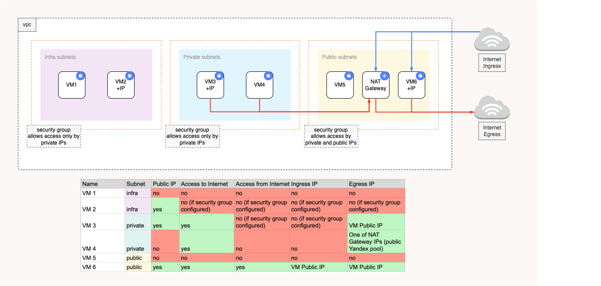
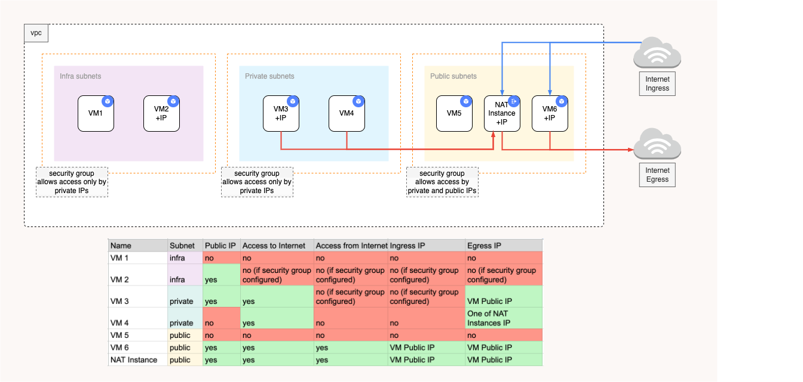

# Yandex Cloud VPC Terraform module

Terraform module which creates Yandex Cloud VPC resources.

## VPC Layout
This Terraform module provides the following types of networks:
* **intra**: If you need private subnets that should have no Internet routing (in the sense of [RFC1918 Category 1 subnets](https://tools.ietf.org/html/rfc1918)), `intra_subnets` should be specified. These networks does not have any routes to NAT. It also recommended to configure security group to restrict public inbound/outbound access at these networks.
* **private**: These networks have a route to NAT Gateway (NAT Instance). It means, that instances with private IPs will have access to the Internet via the NAT Gateway (NAT Instance). It also recommended to configure security group to restrict public inbound access at these networks.
* **public**: These networks do not have a route to NAT Gateway (NAT Instance). It means, that the access to/from the VM will be available only in case of attached public IP.

<b>VPC layout with NAT Gateway</b>
 

<b>VPC layout with NAT Instance</b>
 

### Single NAT Instance

If `single_nat_instance = true`, then all private subnets will route their Internet traffic through this single NAT gateway. The NAT gateway will be placed in the first public subnet in your `public_subnets` block.

## Examples

Examples codified under
the [`examples`](https://github.com/terraform-yacloud-modules/terraform-yandex-vpc/tree/main/examples) are intended
to give users references for how to use the module(s) as well as testing/validating changes to the source code of the
module. If contributing to the project, please be sure to make any appropriate updates to the relevant examples to allow
maintainers to test your changes and to keep the examples up to date for users. Thank you!

<!-- BEGINNING OF PRE-COMMIT-TERRAFORM DOCS HOOK -->
## Requirements

| Name | Version |
|------|---------|
|  [terraform](#requirement\_terraform) | >= 1.3 |
|  [yandex](#requirement\_yandex) | >= 0.72.0 |

## Providers

| Name | Version |
|------|---------|
|  [yandex](#provider\_yandex) | >= 0.72.0 |

## Modules

| Name | Source | Version |
|------|--------|---------|
|  [nat\_instance](#module\_nat\_instance) | git::https://github.com/terraform-yacloud-modules/terraform-yandex-instance.git | v1.0.0 |

## Resources

| Name | Type |
|------|------|
| [yandex_compute_image.nat_instance](https://registry.terraform.io/providers/yandex-cloud/yandex/latest/docs/resources/compute_image) | resource |
| [yandex_vpc_address.nat_instance](https://registry.terraform.io/providers/yandex-cloud/yandex/latest/docs/resources/vpc_address) | resource |
| [yandex_vpc_gateway.nat](https://registry.terraform.io/providers/yandex-cloud/yandex/latest/docs/resources/vpc_gateway) | resource |
| [yandex_vpc_network.main](https://registry.terraform.io/providers/yandex-cloud/yandex/latest/docs/resources/vpc_network) | resource |
| [yandex_vpc_route_table.intra](https://registry.terraform.io/providers/yandex-cloud/yandex/latest/docs/resources/vpc_route_table) | resource |
| [yandex_vpc_route_table.private](https://registry.terraform.io/providers/yandex-cloud/yandex/latest/docs/resources/vpc_route_table) | resource |
| [yandex_vpc_route_table.public](https://registry.terraform.io/providers/yandex-cloud/yandex/latest/docs/resources/vpc_route_table) | resource |
| [yandex_vpc_security_group.nat_instance](https://registry.terraform.io/providers/yandex-cloud/yandex/latest/docs/resources/vpc_security_group) | resource |
| [yandex_vpc_security_group_rule.nat_instance](https://registry.terraform.io/providers/yandex-cloud/yandex/latest/docs/resources/vpc_security_group_rule) | resource |
| [yandex_vpc_security_group_rule.nat_instance_ssh](https://registry.terraform.io/providers/yandex-cloud/yandex/latest/docs/resources/vpc_security_group_rule) | resource |
| [yandex_vpc_subnet.intra](https://registry.terraform.io/providers/yandex-cloud/yandex/latest/docs/resources/vpc_subnet) | resource |
| [yandex_vpc_subnet.private](https://registry.terraform.io/providers/yandex-cloud/yandex/latest/docs/resources/vpc_subnet) | resource |
| [yandex_vpc_subnet.public](https://registry.terraform.io/providers/yandex-cloud/yandex/latest/docs/resources/vpc_subnet) | resource |
| [yandex_vpc_network.main](https://registry.terraform.io/providers/yandex-cloud/yandex/latest/docs/data-sources/vpc_network) | data source |

## Inputs

| Name | Description | Type | Default | Required |
|------|-------------|------|---------|:--------:|
|  [azs](#input\_azs) | A list of availability zones names or ids in the region | `list(string)` | `[]` | no |
|  [blank\_name](#input\_blank\_name) | Blank name which will be used for all resources | `string` | n/a | yes |
|  [create\_intra\_route\_table](#input\_create\_intra\_route\_table) | Controls if route tables should be created for intra subnets | `bool` | `true` | no |
|  [create\_nat\_gateway](#input\_create\_nat\_gateway) | If true, NAT Gateway will be created | `bool` | `false` | no |
|  [create\_nat\_instance](#input\_create\_nat\_instance) | If true, NAT Instance will be created | `bool` | `false` | no |
|  [create\_private\_route\_table](#input\_create\_private\_route\_table) | Controls if route tables should be created for private subnets | `bool` | `true` | no |
|  [create\_public\_route\_table](#input\_create\_public\_route\_table) | Controls if route tables should be created for public subnets | `bool` | `true` | no |
|  [create\_subnets](#input\_create\_subnets) | Controls if subnets should be created | `bool` | `true` | no |
|  [create\_vpc](#input\_create\_vpc) | Controls if VPC should be created | `bool` | `true` | no |
|  [dhcp](#input\_dhcp) | DHCP options | <pre>object({     domain_name         = string     domain_name_servers = list(string)     ntp_servers         = list(string)   })</pre> | `null` | no |
|  [folder\_id](#input\_folder\_id) | Folder ID | `string` | `null` | no |
|  [intra\_routes](#input\_intra\_routes) | Map of routes for intra subnets | <pre>list(object({     enabled            = bool,     destination_prefix = string,     next_hop_address   = string,   }))</pre> | `[]` | no |
|  [intra\_subnet\_suffix](#input\_intra\_subnet\_suffix) | Suffix to append to intra subnets name | `string` | `"intra"` | no |
|  [intra\_subnets](#input\_intra\_subnets) | Map of intra subnets | `list(list(string))` | `[]` | no |
|  [labels](#input\_labels) | A set of labels | `map(string)` | `{}` | no |
|  [nat\_instance\_allow\_ssh](#input\_nat\_instance\_allow\_ssh) | If true, ssh access will be enabled at NAT Instances | `bool` | `false` | no |
|  [nat\_instance\_family](#input\_nat\_instance\_family) | VM family for NAT Instance. By default, it's Yandex official NAT Instance family: https://yandex.cloud/ru/marketplace/products/yc/nat-instance-ubuntu-22-04-lts | `string` | `"nat-instance-ubuntu-2204"` | no |
|  [nat\_instance\_image\_id](#input\_nat\_instance\_image\_id) | The image\_id to be used for the NAT instance. If left empty, a default image\_id from `nat_instance_family` will be used. | `string` | `""` | no |
|  [nat\_instance\_vm](#input\_nat\_instance\_vm) | A set of default VM options for NAT Instances' VMs | <pre>object({     platform_id               = string     cores                     = number     memory                    = number     core_fraction             = number     boot_disk_size            = number     preemptible               = bool     allow_stopping_for_update = bool     generate_ssh_key          = bool     ssh_user                  = string     ssh_pubkey                = string     enable_oslogin            = bool   })</pre> | <pre>{   "allow_stopping_for_update": false,   "boot_disk_size": 20,   "core_fraction": 100,   "cores": 2,   "enable_oslogin": true,   "generate_ssh_key": false,   "memory": 4,   "platform_id": "standard-v3",   "preemptible": false,   "ssh_pubkey": null,   "ssh_user": "ubuntu" }</pre> | no |
|  [private\_routes](#input\_private\_routes) | Map of routes for private subnets | <pre>list(object({     enabled            = bool,     destination_prefix = string,     next_hop_address   = string,   }))</pre> | `[]` | no |
|  [private\_routes\_gateway](#input\_private\_routes\_gateway) | Defines how private subnets connect to the internet.  Supported values: - none         : No internet route will be added. - nat\_instance : Use a NAT instance for internet access (a route will be created if `create_nat_instance` is enabled). - nat\_gateway  : Use a NAT Gateway for internet access (a route will be created if `create_nat_gateway` is enabled). | `string` | `"none"` | no |
|  [private\_subnet\_suffix](#input\_private\_subnet\_suffix) | Suffix to append to private subnets name | `string` | `"prv"` | no |
|  [private\_subnets](#input\_private\_subnets) | Map of private subnets | `list(list(string))` | `[]` | no |
|  [public\_routes](#input\_public\_routes) | Map of routes for public subnets | <pre>list(object({     enabled            = bool,     destination_prefix = string,     next_hop_address   = string,   }))</pre> | `[]` | no |
|  [public\_subnet\_suffix](#input\_public\_subnet\_suffix) | Suffix to append to public subnets name | `string` | `"pub"` | no |
|  [public\_subnets](#input\_public\_subnets) | Map of public subnets | `list(list(string))` | `[]` | no |
|  [single\_nat\_instance](#input\_single\_nat\_instance) | Should be true if you want to provision a single shared NAT Instance across all of your private networks | `bool` | `false` | no |
|  [vpc\_id](#input\_vpc\_id) | If create\_vpc set to false you may provide vpc\_id to use existing VPC | `string` | `""` | no |

## Outputs

| Name | Description |
|------|-------------|
|  [intra\_rt](#output\_intra\_rt) | Intra route tables info |
|  [intra\_subnets](#output\_intra\_subnets) | Raw information about intra subnets |
|  [intra\_subnets\_cidr\_blocks](#output\_intra\_subnets\_cidr\_blocks) | List of intra subnets cidr\_blocks |
|  [intra\_subnets\_ids](#output\_intra\_subnets\_ids) | List of intra subnets IDs |
|  [intra\_subnets\_ipv6\_cidr\_blocks](#output\_intra\_subnets\_ipv6\_cidr\_blocks) | List of intra subnets IPv6 cidr\_blocks |
|  [nat\_gw\_id](#output\_nat\_gw\_id) | NAT |
|  [nat\_id](#output\_nat\_id) | NAT Gateway ID |
|  [nat\_instance\_ip](#output\_nat\_instance\_ip) | n/a |
|  [nat\_instance\_sg\_id](#output\_nat\_instance\_sg\_id) | n/a |
|  [private\_rt](#output\_private\_rt) | Private route tables info |
|  [private\_subnets](#output\_private\_subnets) | Raw information about private subnets |
|  [private\_subnets\_cidr\_blocks](#output\_private\_subnets\_cidr\_blocks) | List of private subnets cidr\_blocks |
|  [private\_subnets\_ids](#output\_private\_subnets\_ids) | List of private subnets IDs |
|  [private\_subnets\_ipv6\_cidr\_blocks](#output\_private\_subnets\_ipv6\_cidr\_blocks) | List of private subnets IPv6 cidr\_blocks |
|  [public\_rt](#output\_public\_rt) | Public route tables info |
|  [public\_subnets](#output\_public\_subnets) | Raw information about public subnets |
|  [public\_subnets\_cidr\_blocks](#output\_public\_subnets\_cidr\_blocks) | List of public subnets cidr\_blocks |
|  [public\_subnets\_ids](#output\_public\_subnets\_ids) | List of public subnets IDs |
|  [public\_subnets\_ipv6\_cidr\_blocks](#output\_public\_subnets\_ipv6\_cidr\_blocks) | List of public subnets IPv6 cidr\_blocks |
|  [vpc\_id](#output\_vpc\_id) | VPC ID |
|  [vpc\_name](#output\_vpc\_name) | VPC Name |
<!-- END OF PRE-COMMIT-TERRAFORM DOCS HOOK -->

## License

Apache-2.0 Licensed.
See [LICENSE](https://github.com/terraform-yacloud-modules/terraform-yandex-vpc/blob/main/LICENSE).
